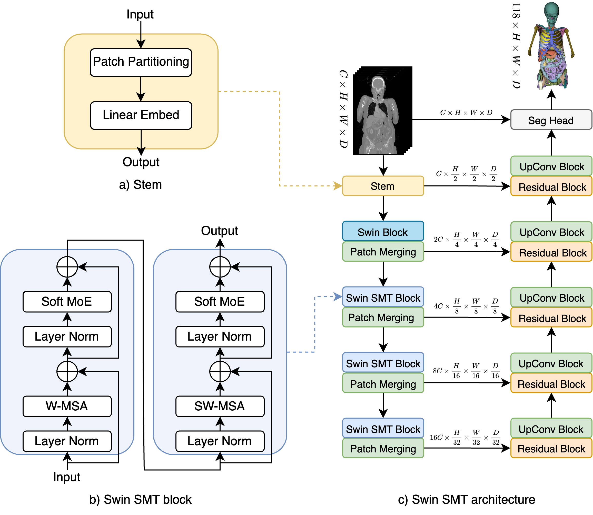

# Swin SMT: Global Sequential Modeling for Enhancing 3D Medical Image Segmentation

This is the official code and pre-trained weights for paper 
"Swin SMT: Global Sequential Modeling for Enhancing 3D Medical Image Segmentation" early accepted (top 11%) at the 27th International Conference on Medical Image Computing and Computer Assisted Intervention (MICCAI) 2024.

To the best of our knowledge, this is the first benchmark of [TotalSegmentator-V2](https://github.com/wasserth/TotalSegmentator).
The [dataset](https://zenodo.org/records/10047292) consists od 1228 CT scans and 117 major anatomical structure segmentations. Following the original split, 
we train, validate and test model on 1082, 57, and 89 cases, respectively.




## Abstract

Recent advances in Vision Transformers (ViTs) have significantly enhanced medical image segmentation by facilitating the learning of global relationships. 
However, these methods face a notable challenge in capturing diverse local and global long-range sequential feature representations, particularly evident in whole-body CT (WBCT) scans. 
To overcome this limitation, we introduce Swin Soft Mixture Transformer (Swin SMT), a novel architecture based on Swin UNETR. 
This model incorporates a Soft Mixture-of-Experts (Soft MoE) to effectively handle complex and diverse long-range dependencies. 
The use of Soft MoE allows for scaling up model parameters maintaining a balance between computational complexity and segmentation performance in both training and inference modes. 
We evaluate Swin SMT on the publicly available TotalSegmentator-V2 dataset, which includes 117 major anatomical structures in WBCT images. 
Comprehensive experimental results demonstrate that Swin SMT outperforms several state-of-the-art methods in 3D anatomical structure segmentation, achieving an average Dice Similarity Coefficient of 85.09%.

## Swin SMT

Swin SMT can be easily integrated and used as a network for 3D segmentation tasks in any PyTorch project, especially in 
medical image segmentation. Usage:
```python
import torch
from src.models.swin_smt import SwinSMT

x_input = torch.randn(1, 1, 128, 128, 128)

model = SwinSMT(
        in_channels=1,
        out_channels=118,
        img_size=(128, 128, 128),
        spatial_dims=3,
        use_v2=True,
        feature_size=48,
        use_moe=True,
        num_experts=4,
        num_layers_with_moe=3
    )

model(x_input)
```

## Quantitative results

| **Method**           | **Params (M)** | **Time (s)** | **Organs** | **Vertebrae** | **Muscles** | **Ribs** | **Vessels** | **Overall ⬆** |
|----------------------|----------------|--------------|------------|-----------------|---------------|------------|----------------|----------------|
| UNETR [3]            | 102.02         | 35           | 73.84      | 60.70           | 82.35         | 69.27      | 61.49          | 70.88 (*)       |
| SwinUNETR-S [2]      | 18.34          | 15           | 78.21      | 63.43           | 85.02         | 69.98      | 62.23          | 73.90 (*)       |
| nnFormer [4]         | 149.30         | 99           | 79.26      | 73.87           | 74.97         | 74.03      | 74.97          | 75.48 (*)       |
| DiNTS [5]            | 147.00         | 150          | 80.05      | 71.42           | 85.32         | 73.71      | 70.13          | 77.64 (*)       |
| UNesT [6]            | 87.30          | 45           | 80.75      | 71.93           | 86.43         | 72.79      | 69.61          | 77.70 (*)       |
| 3D UX-Net [7]        | 53.00          | 74           | 83.03      | 79.54           | 86.99         | 82.54      | 75.01          | 82.53 (*)       |
| SwinUNETR-B [2]      | 72.76          | 37           | 83.46      | 79.76           | 87.57         | 82.61      | 75.23          | 82.81 (*)       |
| nnU-Net [8]          | 370.74         | 300          | 82.02      | 82.89           | 86.98         | 85.27      | 75.51          | 83.44 (*)       |
| SwinUNETR-L [2]      | 290.40         | 145          | 83.26      | 82.02           | 87.99         | 83.82      | 75.60          | 83.59 (*)       |
| 3D RepUX-Net [9]     | 65.80          | 80           | 80.85      | 84.00           | 87.63         | 84.22      | 75.91          | 83.81 (*)       |
| Universal Model [10] | 62.25          | 39           | 82.25      | **84.46**       | 87.58         | 86.49      | 76.11          | 84.02 (*)       |
| **Swin SMT (ours)**  | 170.78         | 60           | **83.70**  | 83.03           | **88.70**     | **86.60**  | **77.54**      | **85.09**       |


## Qualitative results

Due to the high number of classes, we decided to show qualitative results for selected organs.
<div style="display: flex; align-items: center; justify-content: center;">
    <div style="text-align: center; margin-right: 20px;">
         
        
        
        <p style="font-size: 14px; margin-top: 5px;">Ground truth</p>
    </div>
    <div style="text-align: center;">
        
        
        
        <p style="font-size: 14px; margin-top: 5px;">Swin SMT</p>
    </div>
</div>

## Hardware requirements

We trained Swin SMT on NVIDIA DGX server, eqquiped with 8 &times; NVIDIA A100 40GB GPUs. 

## Citation

ArXiv preprint can be found [here](https://arxiv.org/pdf/2407.07514).

If you find this repository useful, please consider citing this paper:
```
@article{plotka2024swinsmt,
  title={Swin SMT: Global Sequential Modeling for Enhancing 3D Medical Image Segmentation},
  author={Płotka, Szymon and Chrabaszcz, Maciej and Biecek, Przemyslaw},
  journal={arXiv preprint arXiv:2407.07514},
  year={2024}
```

## References

[1] Wasserthal, Jakob, et al. "TotalSegmentator: robust segmentation of 104 anatomic structures in CT images." Radiology: Artificial Intelligence 5.5 (2023).

[2] Tang, Yucheng, et al. "Self-supervised pre-training of swin transformers for 3d medical image analysis." Proceedings of the IEEE/CVF Conference on Computer Vision and Pattern Recognition. 2022

[3] Hatamizadeh, Ali, et al. "Unetr: Transformers for 3d medical image segmentation." Proceedings of the IEEE/CVF Winter Conference on Applications of Computer Vision. 2022.

[4] Zhou, Hong-Yu, et al. "nnformer: Volumetric medical image segmentation via a 3d transformer." IEEE Transactions on Image Processing (2023).

[5] He, Yufan, et al. "Dints: Differentiable neural network topology search for 3d medical image segmentation." Proceedings of the IEEE/CVF Conference on Computer Vision and Pattern Recognition. 2021.

[6] Yu, Xin, et al. "Unest: local spatial representation learning with hierarchical transformer for efficient medical segmentation." Medical Image Analysis 90 (2023): 102939.

[7] Lee, Ho Hin, et al. "3D UX-Net: A Large Kernel Volumetric ConvNet Modernizing Hierarchical Transformer for Medical Image Segmentation." The Eleventh International Conference on Learning Representations. 2023.

[8] Isensee, Fabian, et al. "nnU-Net: a self-configuring method for deep learning-based biomedical image segmentation." Nature methods 18.2 (2021): 203-211.

[9] Lee, Ho Hin, et al. "Scaling up 3d kernels with bayesian frequency re-parameterization for medical image segmentation." International Conference on Medical Image Computing and Computer-Assisted Intervention. Cham: Springer Nature Switzerland, 2023.

[10] Liu, Jie, et al. "Clip-driven universal model for organ segmentation and tumor detection." Proceedings of the IEEE/CVF International Conference on Computer Vision. 2023.

[11] Puigcerver, Joan, et al. "From Sparse to Soft Mixtures of Experts." The Twelfth International Conference on Learning Representations.